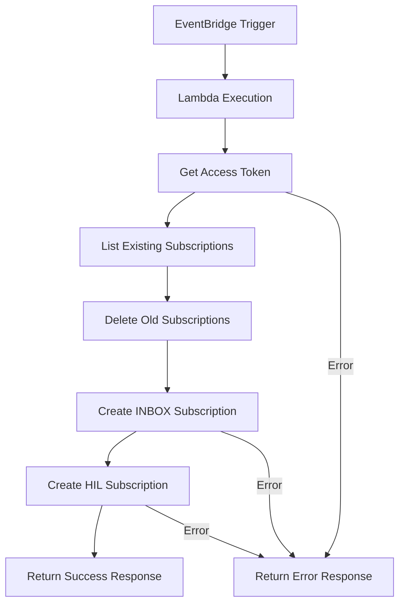

# 🔄 Lambda Subscription Renewal

Función AWS Lambda para renovación automática de suscripciones Microsoft Graph webhook para clasificación de emails.

## 📋 Descripción

Este Lambda se ejecuta automáticamente cada 2 días para:
- ✅ Verificar suscripciones existentes
- 🗑️ Eliminar suscripciones próximas a expirar  
- 🆕 Crear nuevas suscripciones para INBOX y HIL
- 📧 Mantener activo el sistema de clasificación automática

## 🏗️ Arquitectura

```
EventBridge → Lambda Subscription Renewal → Microsoft Graph API
    ↓
┌─────────────────────────────────────────────────────────┐
│  🔄 Renovación Automática cada 2 días                  │
│  ├── 📋 Listar suscripciones existentes                │
│  ├── 🗑️ Eliminar suscripciones expiradas               │
│  ├── 📥 Crear suscripción INBOX                        │
│  └── 🆕 Crear suscripción HIL                          │
└─────────────────────────────────────────────────────────┘
```

## 📁 Estructura del Proyecto

```
subscription-renewal-lambda/
├── handler.py                      # Handler principal del Lambda
├── src/
│   ├── __init__.py                 # Módulo Python
│   ├── subscription_manager.py     # Gestor de suscripciones
│   ├── config.py                   # Configuración y variables
│   └── utils.py                    # Utilidades y helpers
├── requirements.txt                # Dependencias
├── .env.example                    # Plantilla variables de entorno
├── requirements.txt                # Dependencias
└── README.md                       # Esta documentación
```

## 🚀 Instalación y Despliegue

### 1. Configurar Variables de Entorno

Copia `.env.example` y configura las variables:

```bash
# Microsoft Graph API
MS_TENANT_ID=tu_tenant_id
MS_CLIENT_ID=tu_client_id  
MS_CLIENT_SECRET=tu_client_secret

# Configuración objetivo
TARGET_USER_EMAIL=helpdesk_ivanti@siman.com
WEBHOOK_URL=https://tu-webhook-url.amazonaws.com/clasificador-emails-v2

# Opcional
HIL_FORWARD_TO_EMAIL=destino@ejemplo.com
LAMBDA_VERSION=1.0.0
LOG_LEVEL=INFO
```

### 2. Configuración Manual en AWS

1. **Crear función Lambda:**
   - Name: `subscription-renewal-lambda`
   - Runtime: `Python 3.12`
   - Handler: `handler.lambda_handler`
   - Timeout: `60 segundos`
   - Memory: `256 MB`

2. **Subir código:**
   - Usa el archivo `subscription-renewal.zip` generado

3. **Configurar variables de entorno:**
   - Copia las variables desde `.env.example`

4. **Configurar EventBridge:**
   - Trigger: `EventBridge (CloudWatch Events)`
   - Schedule: `rate(2 days)` o `cron(0 12 */2 * ? *)`

## 🔧 Configuración EventBridge

### Opción 1: Rate Expression (Recomendado)
```
rate(2 days)
```

### Opción 2: Cron Expression
```
cron(0 12 */2 * ? *)  # Cada 2 días a las 12:00 UTC
```

### Opción 3: Cron Expression Específico
```
cron(0 10 * * 1,3,5 *)  # Lunes, Miércoles, Viernes a las 10:00 UTC
```

## 🔐 Permisos Requeridos

### Microsoft Graph API (Azure AD)
- `Mail.ReadWrite` (Application)
- `User.Read.All` (Application)  
- `Directory.Read.All` (Application)

### AWS IAM (Mínimos)
```json
{
    "Version": "2012-10-17",
    "Statement": [
        {
            "Effect": "Allow",
            "Action": [
                "logs:CreateLogGroup",
                "logs:CreateLogStream",
                "logs:PutLogEvents"
            ],
            "Resource": "arn:aws:logs:*:*:*"
        }
    ]
}
```

## 📊 Monitoreo y Logs

### CloudWatch Logs
Los logs se almacenan en: `/aws/lambda/subscription-renewal-lambda`

### Ejemplo de Log Exitoso
```
[INFO] Iniciando renovación automática de suscripciones
[INFO] Obteniendo token de acceso...
[INFO] Token de acceso obtenido exitosamente
[INFO] Obteniendo suscripciones existentes...
[INFO] Suscripciones encontradas: 2
[INFO] Eliminando suscripción abc123...
[INFO] Suscripción eliminada exitosamente
[INFO] Creando suscripción INBOX...
[INFO] Suscripción INBOX creada: def456
[INFO] Creando suscripción HIL...
[INFO] Suscripción HIL creada: ghi789
[INFO] Proceso completado. Éxito: True
```

## 🧪 Testing

### Prueba Manual desde AWS Console
1. Ve a la función Lambda
2. Crea un evento de prueba:
```json
{
  "source": "aws.events",
  "detail-type": "Scheduled Event",
  "detail": {}
}
```
3. Ejecuta la prueba

### Verificación de Suscripciones
Puedes verificar que las suscripciones se crearon correctamente revisando:
- Los logs de CloudWatch
- La respuesta del Lambda (statusCode: 200)
- Microsoft Graph API directamente

## 🔍 Troubleshooting

### Error: "Token de acceso no obtenido"
- Verificar `MS_TENANT_ID`, `MS_CLIENT_ID`, `MS_CLIENT_SECRET`
- Verificar permisos de la aplicación en Azure AD
- Verificar que el secreto no haya expirado

### Error: "No se pudo obtener carpeta HIL"
- Verificar permisos `Mail.ReadWrite`
- Verificar que `TARGET_USER_EMAIL` sea correcto
- La carpeta se crea automáticamente si no existe

### Error: "Error creando suscripción"
- Verificar que `WEBHOOK_URL` sea accesible
- Verificar que el webhook responda correctamente a GET y POST
- Verificar límites de suscripciones en el tenant

### Lambda Timeout
- Aumentar timeout a 60+ segundos
- Verificar conectividad de red
- Revisar si hay dependencias lentas

## 📈 Métricas y Alertas

### CloudWatch Métricas Recomendadas
- `Duration`: Tiempo de ejecución
- `Errors`: Errores de ejecución  
- `Invocations`: Número de ejecuciones

### Alertas Recomendadas
- Error rate > 5%
- Duration > 45 segundos
- No invocation en 3 días

## 🔄 Flujo de Funcionamiento



## 📝 Changelog

### v1.0.0
- ✅ Implementación inicial
- ✅ Renovación automática de suscripciones INBOX y HIL
- ✅ Logging completo
- ✅ Manejo de errores robusto

**⚡ Mantén tus suscripciones siempre activas con renovación automática!**